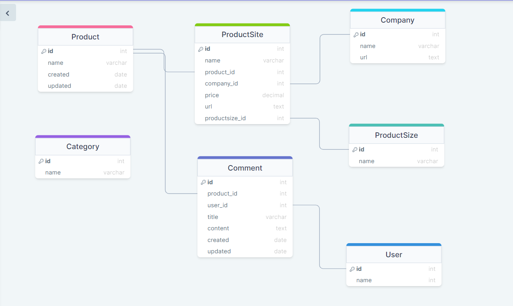

# product-review-backend
___
### INSTALLATION
____
clone [repo](git@github.com:AKumanov/product-review-backend.git)

create a virtual env and activate

install project dependencies

```
pip install virtualenv
env\scripts\activate
pip install -r requirements.txt
python manage.py runserver
```
____

## Project Structure
```
product_review_backend
    ├── product_review_backend
       ├──auth
       │     └──tests
       │     └──admin.py
       │     └──apps.py
       │     └──models.py
       │     └──serializers.py
       │     └──urls.py
       │     └──views.py
       ├──reviews
       │     └──tests
       │     └──admin.py
       │     └──apps.py
       │     └──models.py
       │     └──serializers.py
       │     └──urls.py
       │     └──views.py
       ├──product_review_backend
       │     └──asgi
       │     └──settings.py
       │     └──urls.py
       │     └──wsgi.py
   │manage.py
   │README.md
   │requirements.txt
```

### database design:
____

____
### Content
___
- Settings and Creating Models
- Admin Site Customization
- Creating views and serializers
- Dynamic Nested Serialization
- Uploading Images
- Enabling Cors
- JWT Authentication
- Login and Register
- Change Password and Update Profile
- Logout